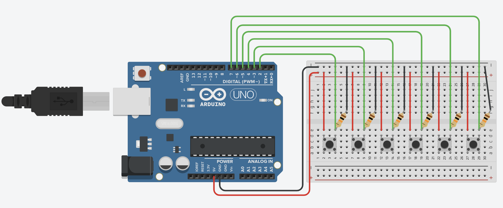
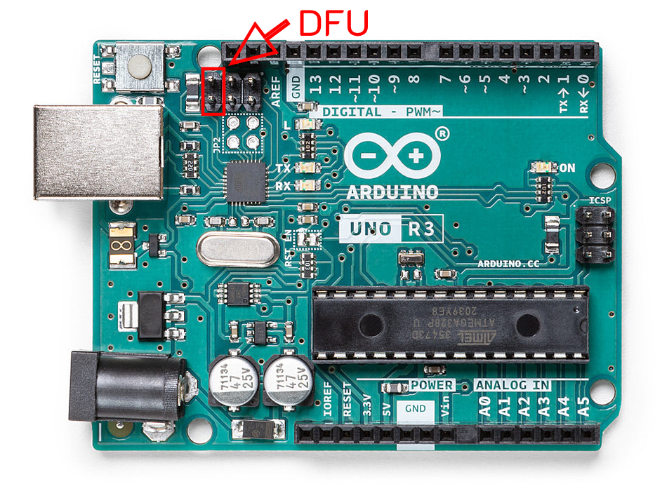
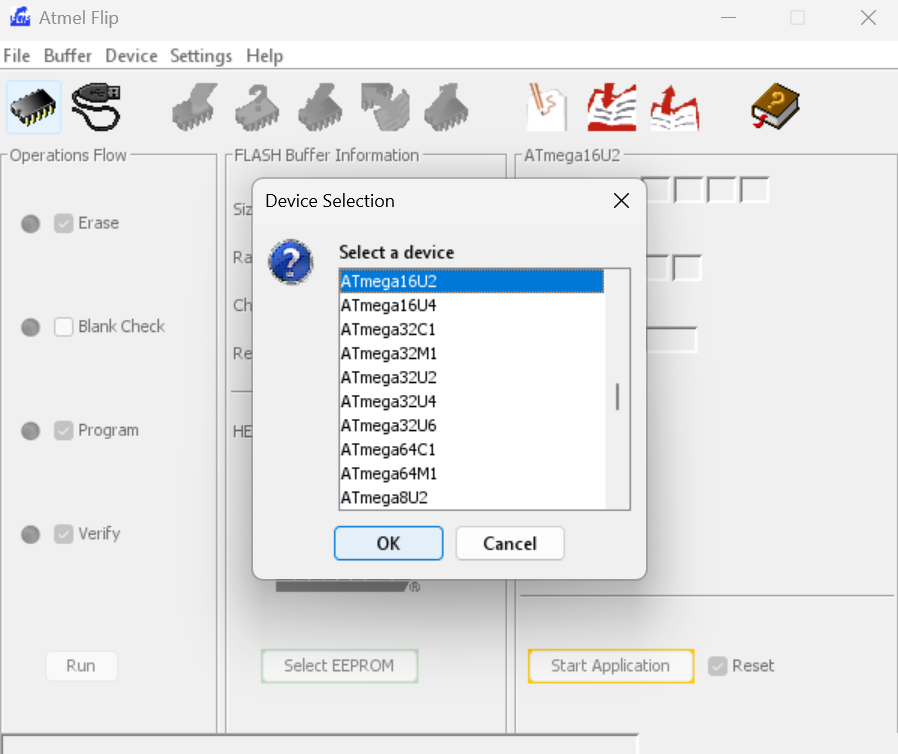
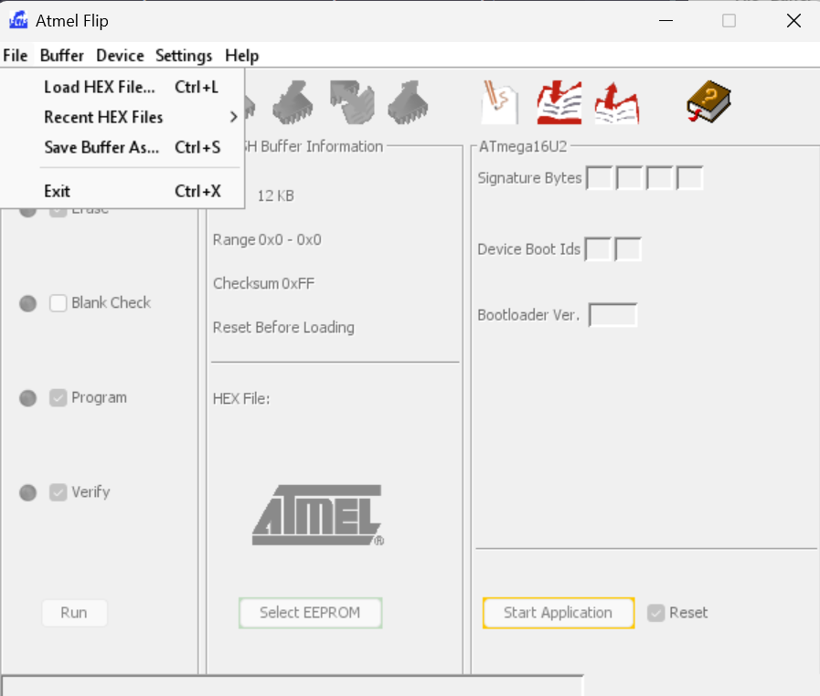

# uno-HID-keyboard
This project demonstrates how to use an **Arduino Uno**, equipped with an **ATmega16u2** chip, and simple button circuit to function as an HID keyboard. Including examples of using the device as a piano key input for VST or MIDI players.

**Tested Devices/OS:**
- Arduino Uno R3
- Windows 10/11 (via Notepad & VMPK)
- Linux: Ubuntu, Raspberry (via Text Editor & VMPK)

## Prerequisite
- Arduino Uno R3
- Buttons
- 10K Resistor
- Wire
- Jumper Cap
- Breadboard/Perfboard
- [Flip](https://www.microchip.com/en-us/development-tool/flip) (Requires [Java Runtime Environment](https://www.java.com/en/download/manual.jsp))
- [VMPK](https://vmpk.sourceforge.io/) (Optional)

## Circuit
The circuit is using a simple button configuration. The 10K resistors are used as pull down resistors, ensuring that the pins are as close to 0V as possible when no external signal is present. **Use this as a reference for the provided examples.**



## Flashing HID firmware with Flip
<p align="center" style="color:red">Use genuine Arduino only since fake or clone integrated with CH340 chip which cannot be used for DFU purposes and not supported by this guide.

To install **HID firmware** connect your arduino to the PC. To get into **DFU** mode. **If you want make changes with your code, you can always change back to original firmware.**

**Install [Flip](https://www.microchip.com/en-us/development-tool/flip) and [Java Runtime Environment](https://www.java.com/en/download/manual.jsp) first.** Then connect arduino to computer.

**Short these two pins** using wire or jumper cap (recommended) and pull out. You can notice the arduino entering DFU mode by disconnecting and connecting sound from your OS.


*img ref: https://store.arduino.cc/products/arduino-uno-rev3*

The device should show up in device manager as **Atmega16u2**. If not or if you get the error **"AtLibUsbDfu.dll not found"** install the drivers manually from the device manager. Normally it should be in

```
C:\Program Files (x86)\Atmel\Flip 3.4.7\usb 
```
right click the .inf file and click install.

Inside Flip, Click on the IC button and select **Atmega16u2**



**Click File -> Load Hex File** and select the firmware.



**Click run** to upload the firmware and **replug the Arduino.** Now Arduino become HID device.

## Testing
There are various methods to test your HID devices, but the easiest options include:

- **Text Editor**
Open your preferred text editor to test your input. Simply type using the HID device to ensure it is functioning correctly.

- **VMPK**
Download and install VMPK or a similar software. Use the HID device to test the input by pressing individual keys or playing chords.

## References
Arduino-usbserial-uno.hex: https://github.com/arduino/ArduinoCore-avr/blob/master/firmwares/atmegaxxu2/arduino-usbserial/Arduino-usbserial-uno.hex

Arduino-keyboard-0.3.hex: https://github.com/coopermaa/USBKeyboard/blob/master/firmware/Arduino-keyboard-0.3.hex